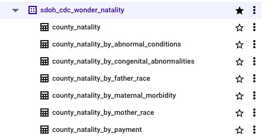
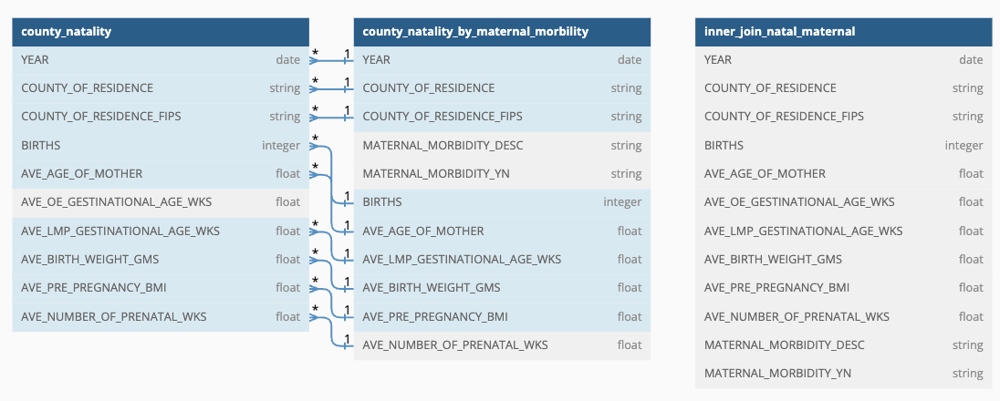
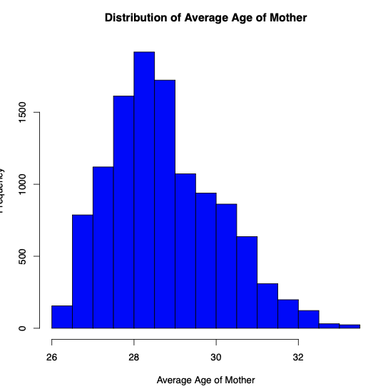
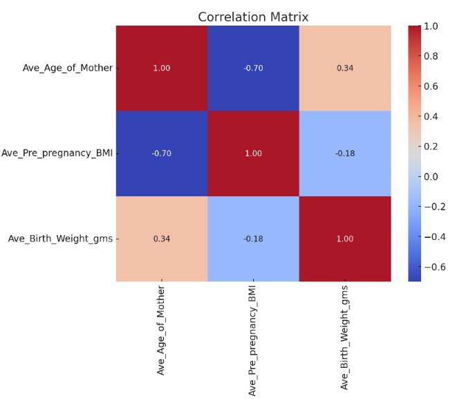
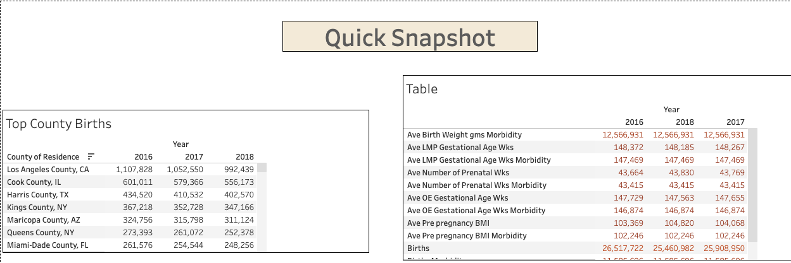

<h1 align="center">CDC Births Data Summary</h1>

  

  

  
  
  
  
  
  
  
  

 

<section id="initial-problem">
  <h2>Initial Problem</h2>
  
This report investigates various factors influencing maternity across the United States. It presents an initial analysis of data scraped from the CDC's summary reports, accessible through Google BigQuery.

</section>

<section>
  <h2>Table of Contents</h2>
  <ul>
    <li><a href="#initial-problem" target="_parent">Initial Problem</a></li>
    <li><a href="#about-the-data" target="_parent">About The Data</a></li>
    <li><a href="#SQL-Preliminaries" target="_parent">SQL Preliminaries</a></li>
  </ul>
</section>

<section id="about-the-data">
  <h2>About The Data</h2>
  
This dataset, sourced from the CDC's National Center for Health Statistics, provides detailed statistics on live births in the United States from 2016 to 2022, including demographic and health information derived from birth certificates. It covers a range of data such as mother's race, age, tobacco use, delivery methods, and congenital anomalies. The dataset ensures privacy by suppressing data representing 1-9 births and is a part of the National Vital Statistics System available on the CDC WONDER Online Database. For more information visit: https://wonder.cdc.gov/wonder/help/Natality-expanded.html

</section>

<section id="SQL-Preliminaries">
  <h2>SQL Preliminaries</h2>
  
 An SQL analysis of the relationship between live birth rates in the United States and anomalies from 2016 to 2022, using data from the CDC's National Center for Health Statistics. (Data is gathered from Google BigQuery)

 [Data Analysis Question & Answers](questions_and_answers.md)
 

  
 
    For a further link on what each dataset has and variables within each table: 

  

  ## Entity Relationship Diagram

  
 

</section>

  <section id="data set used">
    <h2>Data Set Used</h2>
    

Seven key [datasets](datasets.md) for this case study

## Entity Relationship Diagram

  <section id="methods">
    <h2>Methods</h2>
 
- Exploratory Data Analysis
- Multivariate Analysis
- Visualizations
- Modeling
- Reporting

  <section id="tech-stack">
    <h2>Tech Stack</h2>
    
  - **SQL** (Scrapping Data)
  - **R** (Further investigation)
  - **Tableau**  (Visuals)
  - **Github** (Reporting & Reproduce)

  <section id="quick-glance">
    <h2>Quick glance at the Results</h2>
 

   Distribution
   

  

Correlation Matrix

  

Initial Correlation Assessment:
The heatmap of the correlation matrix provides insights into how these variables are related to each other. For instance, a positive correlation between maternal age and birth weight could suggest that older mothers tend to have babies with higher birth weights.

Predictive Modeling:
Used Random Forest model to identify significant predictors.
Found average birth weight, maternal age, pre-pregnancy BMI, and prenatal weeks as critical factors.
- Average Birth Weight (grams): 2429.82. This was the most significant predictor.
- Average Age of Mother: 2290.50. This was a strong predictor, second only to birth weight.
- Average Pre-pregnancy BMI: 2243.89. Another important predictor​​.

ML Algorithm Accuracy:
Compared radial, sigmoid, and polynomial kernel functions in SVM.
Radial kernel function performed best in terms of RMSE, indicating its effectiveness in modeling high-risk pregnancies.

Root Mean Square Error (RMSE):
- Radial Kernel Function -> 8296.19
- Polynomial Kernel Function -> 12857.87
- Sigmoid Kernel Function -> 16844.82​​

  <section id="limitation">
    <h2>Limitation and what can be Improved</h2
                                             
- Data Scope: Limited to U.S. data; expanding the data set to include global statistics could offer more comprehensive insights.
- Model Diversity: Explore additional machine learning models beyond Random Forest and SVM for potentially better predictions or insights.
- Feature Engineering: Experiment with more complex features or interactions between variables to enhance model performance.
- Real-Time Data Integration: Incorporate real-time data updates for more dynamic and current analyses.
- User Interface: Develop an interactive dashboard for easier access and interpretation of results by non-technical users.

This project offers valuable insights into maternal and infant health, leveraging advanced data analytics and machine learning techniques. Future work could expand the dataset, explore new models, and enhance user interaction to increase the impact and reach of the findings.
   

  <section id="notebook">
    <h2>Explore the notebook</h2
 

To explore the R notebook file click here: (https://github.com/dsrichard97/cdc_births/blob/main/cdcsummary.pdf).

  <section id="report">
    <h2>Report and Presentation</h2
 

 

 For more information click here: (https://public.tableau.com/views/cdc_snapshot/Dashboard1?:language=en-US&:display_count=n&:origin=viz_share_link)

