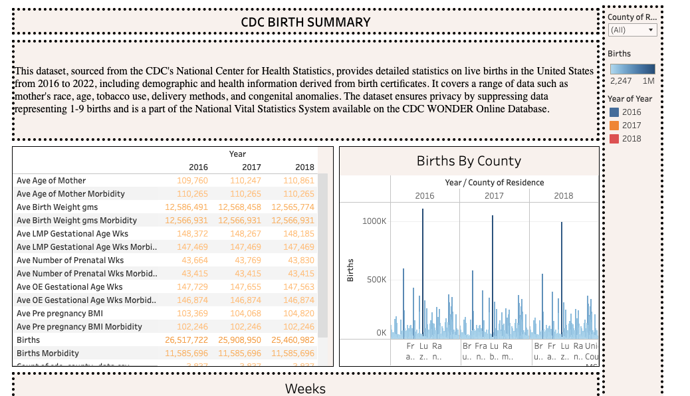

<h1 align="center">CDC Births Data Summary</h1>

  

  

  
  
  
  
  
  
  
  

 

<section id="initial-problem">
  <h2>Initial Problem</h2>
  
This report investigates various factors influencing maternity across the United States. It presents an initial analysis of data scraped from the CDC's summary reports, accessible through Google BigQuery.

</section>

<section>
  <h2>Table of Contents</h2>
  <ul>
    <li><a href="#initial-problem" target="_parent">Initial Problem</a></li>
    <li><a href="#about-the-data" target="_parent">About The Data</a></li>
    <li><a href="#SQL-Preliminaries" target="_parent">SQL Preliminaries</a></li>
    <li><a href="#Entity_Relationship_Diagram" target="_parent">Entity Relationship Diagram</a></li>
    <li><a href="#Limitations" target="_parent">Limitations</a></li>
    <li><a href="#TableauDB" target="_parent">Dashboard</a></li>
    <li><a href="#Resources" target="_parent">Resources</a></li>
  </ul>
</section>

<section id="about-the-data">
  <h2>About The Data</h2>
  
This dataset, sourced from the CDC's National Center for Health Statistics, provides detailed statistics on live births in the United States from 2016 to 2022, including demographic and health information derived from birth certificates. It covers a range of data such as mother's race, age, tobacco use, delivery methods, and congenital anomalies. The dataset ensures privacy by suppressing data representing 1-9 births and is a part of the National Vital Statistics System available on the <b>CDC WONDER Online Database</b>. For more information visit: https://wonder.cdc.gov/wonder/help/Natality-expanded.html

</section>

<section id="SQL-Preliminaries">
  <h2>SQL Preliminaries</h2>
  
 This report presents an SQL analysis exploring the relationship between live birth rates and anomalies in the United States from 2016 to 2022. The analysis utilizes data from the CDC's National Center for Health Statistics, accessed via Google BigQuery.
    

For detailed information on the datasets used, including variables within each table, please visit the links provided in the table below.

    <table border="1">
        <tr>
            <th>Preliminary SQL Scrub</th>
            <th>Link</th>
        </tr>
        <tr>
            <td>Datasets Details</td>
            <td><a href="https://github.com/dsrichard97/cdc_births/blob/main/datasets.md">Datasets</a></td>
        </tr>
        <tr>
            <td>Questions and Answers</td>
            <td><a href="https://github.com/dsrichard97/cdc_births/blob/main/questions_and_answers.md">Q&A</a></td>
        </tr>
    </table>
</section>

<section id="Entity_Relationship_Diagram">
  <h2>Entity Relationship Diagram</h2>
  

    The entity diagram shows the relationship of the <b>inner join</b> used to combine both the tables. Header in tables suggest the keys for each.
    
  

</section>

  <section id="Report_Summary">
    <h2>Report Summary</h2>
 

   Distribution
   

  

Correlation Matrix

  

<b>Initial Correlation Assessment:</b>
The heatmap reveals relationships between variables. Notably, there's a positive correlation between maternal age and birth weight, suggesting that <b>older mothers often have babies with higher birth weights</b>.

<ul>
<b>Predictive Modeling Using Random Forest:</b>
<li>-Average Birth Weight in Grams: 2429.82 - Primary Predictor</li>
<li>-Average Age of Mother: 2290.50 - Strong Secondary Predictor</li>
<li>-Average Pre-pregnancy BMI: 2243.89 - Significant Predictor</li>
</ul>
 

<h3><b>Accuracy</b> of Machine Learning Algorithms: Evaluating <b>Kernel Functions</b> in <b>Support Vector Machines</b></h3>
  

<table>
        <tr>
            <th>Kernel Function</th>
            <th>Root Mean Square Error (RMSE)</th>
        </tr>
        <tr>
            <td>Radial Kernel Function</td>
            <td>8296.19</td>
        </tr>
        <tr>
            <td>Polynomial Kernel Function</td>
            <td>12857.87</td>
        </tr>
        <tr>
            <td>Sigmoid Kernel Function</td>
            <td>16844.82</td>
        </tr>
    </table>

 

  Support Vector Machines (SVMs) are judged or evaluated based on several key criteria, which are crucial for assessing their performance in various machine learning tasks. Typically, the number and nature of the support vectors can provide insights into the model's complexity and generalization capability. Fewer support vectors often mean a simpler model, which might generalize better. As a result, the <b>radial kernel</b> function in SVM is most effective for modeling high-risk pregnancies due to its lower RMSE compared to other functions.

 

    

  <section id="Limitations">
  <h2>Limitations</h2>
  

    While this project provides significant insights into maternal and infant health using advanced data analytics and machine learning, there are areas for enhancement:
    <ul>
      <li><strong>Data Scope:</strong> Currently limited to U.S. data. Including global statistics could yield more comprehensive insights.</li>
      <li><strong>Model Diversity:</strong> Exploring machine learning models beyond Random Forest and SVM may offer improved predictions and insights.</li>
      <li><strong>Feature Engineering:</strong> Utilizing more complex features or exploring interactions between variables could enhance model performance.</li>
      <li><strong>Real-Time Data Integration:</strong> Incorporating real-time data updates would allow for more dynamic and current analyses.</li>
      <li><strong>User Interface:</strong> Developing an interactive dashboard would facilitate easier access and interpretation of results for non-technical users.</li>
    </ul>
    Future enhancements could include expanding the dataset, exploring new models, and improving user interaction, thereby increasing the impact and reach of the findings.
  

</section>

<section id="TableauDB">
  <h2>Dashboard</h2>

   

  

    Gain a clearer understanding of the diverse variables influencing maternal health in our comprehensive data overview. This analysis not only illuminates the myriad factors impacting pregnancy but also reveals how these factors uniquely affect the United States. By exploring this data, users will gain valuable insights into the average trends and magnitudes of these influences. Dive into our dashboard for an enlightening perspective on maternal health – it's designed to captivate and inform, making complex data accessible and engaging for everyone. Click the link <a href="https://public.tableau.com/views/cdc_snapshot/Dashboard1?:language=en-US&:display_count=n&:origin=viz_share_link">here</a> .

</section>

<section id="Resources">
  <h2>Resources</h2>
  
 
    <li><a href="https://public.tableau.com/views/cdc_snapshot/Dashboard1?:language=en-US&:display_count=n&:origin=viz_share_link">Tableau Dashboard</a></li>
    <li><a href="URL">High Level Overview by PowerPoint</a></li>
    <li><a href="https://github.com/dsrichard97/cdc_births/blob/main/cdoverview.png">High Level Overview of Data</a></li>
    <li><a href="https://github.com/dsrichard97/cdc_births/blob/main/Rcodeoverview.png">R code</a></li>
    <li><a href="https://www.cdc.gov/datastatistics/index.html">CDC Information</a></li>
     <li><a href="https://github.com/dsrichard97/cdc_births/blob/main/updated_data.csv">Raw Data</a></li>
  

</section>

